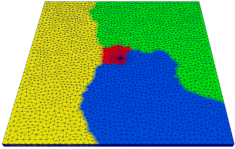
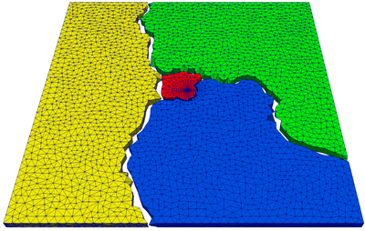
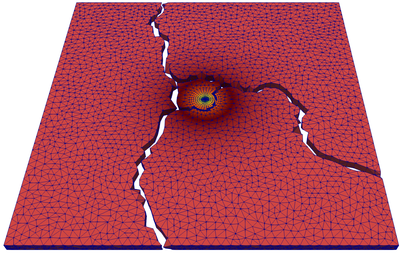
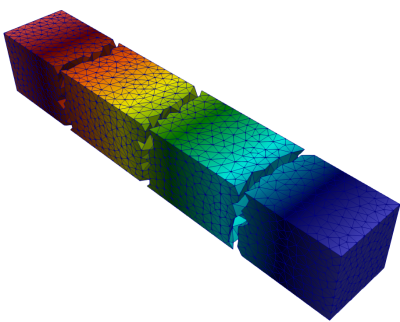
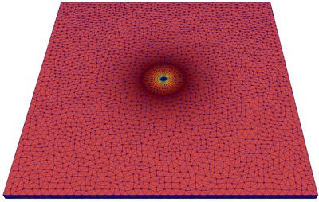
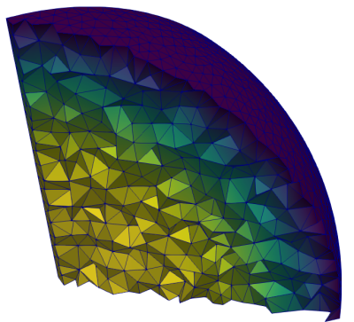

# DivideEtImpera

Master: [

# Divide

Domain division is achieved through [METIS](http://glaros.dtc.umn.edu/gkhome/metis/metis/overview)

<p float="left">
    
    
</p>

# Impera

Ghost vertices indices may be provided to [PETSc](https://www.mcs.anl.gov/petsc/) in order to exchange data between processes

<p float="left">
    
    
</p>

An interface to [Parallel CGNS](https://cgns.github.io/CGNS_docs_current/pcgns/) easily writes results to the output file

<p float="left">
    
    
</p>

---

## Dependencies

To build, it is necessary

- [g++/gcc](https://gcc.gnu.org/) 7.4 (at least)
- [Open MPI](https://gcc.gnu.org/) 2.1.1 (at least)
- [cmake](https://cmake.org/) 3.14.4 (at least)
- [make](https://www.gnu.org/software/make/)
- [HDF5](https://www.hdfgroup.org/solutions/hdf5/) 1.10.0 (at least)
- [CGNS](https://cgns.github.io/index.html) 3.4.0
- [Boost](https://www.boost.org/) 1.70
- [METIS](http://glaros.dtc.umn.edu/gkhome/metis/metis/overview) 5.1.0
- [MSHtoCGNS](https://github.com/felipegiacomelli/MSHtoCGNS) 2.0.0

Once you have installed the first three dependecies, you may install **Boost**, **HDF5**, **CGNS**, **METIS** and **MSHtoCGNS** by executing **setup.sh** located in *Zeta/Setup/*. This script will install **shared libraries** in **release** variant.

---

## Installation

Simply execute

```shell
$ mkdir build
$ cd build
$ cmake .. -G "Unix Makefiles" -DCMAKE_BUILD_TYPE=Release -DBUILD_SHARED_LIBS=TRUE
$ make
$ make test
$ make install
```

---

## Domain division

Use [CgnsReader](https://github.com/felipegiacomelli/MSHtoCGNS/blob/master/include/MSHtoCGNS/CgnsInterface/CgnsReader.hpp) to get a [GridDataPtr](https://github.com/felipegiacomelli/MSHtoCGNS/blob/master/include/MSHtoCGNS/GridData/GridData.hpp) from your input file

```cpp
boost::mpi::communicator world;
GridDataPtr globalGridData;
if (world.rank() == 0) {
    CgnsReader cgnsReader(std::string inputFile);
    globalGridData = cgnsReader.gridData;
}
```
Only the root process must pass the [GridDataPtr](https://github.com/felipegiacomelli/MSHtoCGNS/blob/master/include/MSHtoCGNS/GridData/GridData.hpp) to **DomainDivider**

```cpp
SubdomainDataPtr subdomainData;
if (world.rank() == 0) {
    DomainDivider domainDivider;
    subdomainData = domainDivider.divideDomain(GridDataPtr globalGridData);
}
else {
    DomainDivider domainDivider;
    subdomainData = domainDivider.divideDomain();
}
```
In turn, **SubdomainData** holds the output of the domain division as well as the information necessary to exchange data between subdomains

```cpp
struct SubdomainData {
    SubdomainData() = default;
    SubdomainData(GridDataPtr localGridData, std::vector<int> globalIndices);

    GridDataPtr localGridData;
    std::vector<int> globalIndices;

    std::vector<int> ghostGlobalIndices;
    std::pair<int, int> ownershipRange;

    std::vector<std::vector<int>> verticesOfSubdomains;
    std::vector<std::vector<int>> elementsOfSubdomains;
    std::vector<int> subdomainSizes;
};
```

Where

- *localGridData*: subdomain GridDataPtr
- *globalIndices*: global indices of each subdomain vertex, that includes both local and ghost vertices
- *ghostGlobalIndices*: global indices of the subdomain ghost vertices - it may be passed to [VecCreateGhost](https://www.mcs.anl.gov/petsc/petsc-current/docs/manualpages/Vec/VecCreateGhost.html)
- *ownershipRange*: first and last vertices owned by the subdomain - pass it to **ParallelCgnsWriter**

---

## Parallel output

First, **SubdomainCreator** is used to create an output file in which each subdomains holds a contiguous partition of vertices

```cpp
std::string outputFile;
if (world.rank() == 0) {
    DomainCreator domainCreator(GridDataPtr globalGridData, SubdomainDataPtr subdomainData, std::string outputPath);
    outputFile = domainCreator.getFileName();
}
boost::mpi::broadcast(world, outputFile, 0);
```

Then, **ParallelCgnsWriter** is put to use

```cpp
ParallelCgnsWriter parallelCgnsWriter(std::string outputFile, std::string gridLocation, std::pair<int, int> ownershipRange);
parallelCgnsWriter.writeSolution(std::string solutionName);
parallelCgnsWriter.writeField(std::string fieldName, const std::vector<double>& values);
```
Each subprocess will write the fields values regarding its local vertices

---

## Import

DivideEtImpera may be easily imported to any project using **CMake**, just make sure [*FindDivideEtImpera.cmake*](Zeta/CMakeModules/FindDivideEtImpera.cmake) is on your CMAKE_MODULE_PATH. Hence, you may use this snippet

```cmake
set (DEI_DIR $ENV{DEI_DIR}/${BUILD_TYPE}/${LIBRARY_TYPE})
find_package (DivideEtImpera REQUIRED)
if (DEI_FOUND)
    include_directories (${DEI_INCLUDE_DIR})
endif ()

...

target_link_libraries (${_target} ${DEI_LIBRARIES})
```
Usually,

*$ENV{DEI_DIR}* is set to a directory such as **/home/felipe/Libraries/dei-0.0.0**

*${BUILD_TYPE}* is the lower case ${CMAKE_BUILD_TYPE} - **release** OR **debug**

*${LIBRARY_TYPE}* is the lower case library type - **shared** OR **static**

You may also set ${DEI_DIR} (on your project's CMakeLists.txt) to the installation directory of DivideEtImpera.
